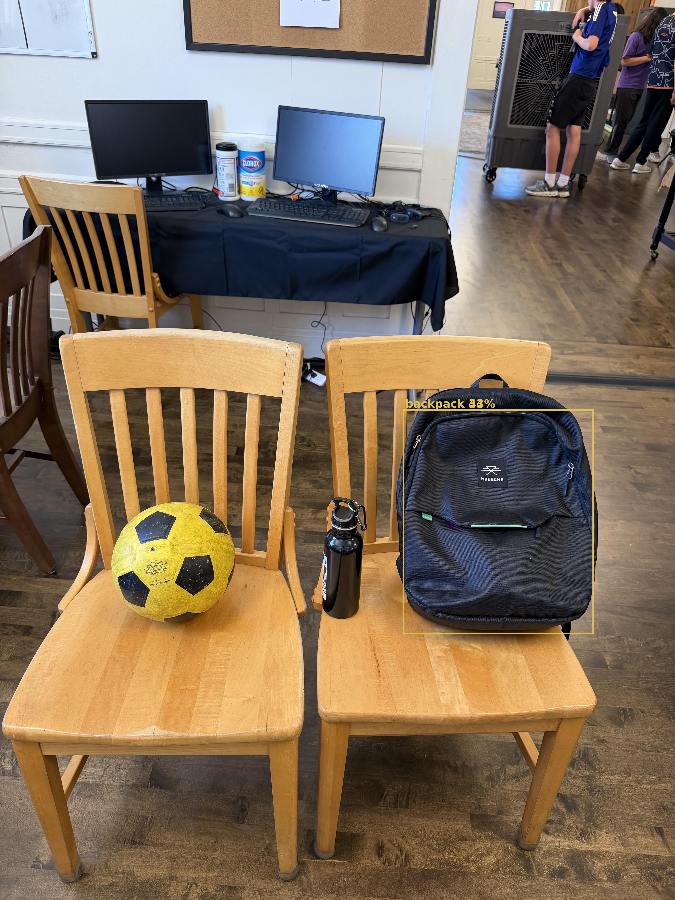

# Gear Checker

An AI tool that checks your soccer bag before practice. You take one photo of your gear, and a Jetson Orin uses object detection to identify what's in the picture, compare it against your packing list, and tell you what you forgot. Everything runs on the device — no cloud, no account, no internet, which matters because a locker room is exactly where you don't have good signal and don't want to wait.

I play soccer, and every week something is missing when I get to practice: the ball, my water bottle, the bag itself still sitting by the door. A paper checklist doesn't fix it, because the problem was never knowing what to bring. It's not checking. So I built something that checks for me.



## The Algorithm

The project uses **SSD-MobileNet-v2**, a convolutional neural network built for real-time object detection and pretrained on the **COCO dataset**, which contains 91 everyday object classes.

It's two pieces stacked together. **MobileNet** is the backbone — it sweeps across the image and extracts features layer by layer, starting with simple things like edges and curves and building them up into recognizable shapes. It's deliberately small and fast, which is the whole reason it can run on a Jetson Orin instead of needing a server rack.

**SSD (Single Shot Detector)** sits on top. Rather than scanning the image over and over, it looks at the whole thing **once** and predicts three things simultaneously for every object it finds: a bounding box (where it is), a class label (what it is), and a confidence score (how sure it is, from 0 to 1). It does this by laying a grid of preset anchor boxes over the feature maps at several different scales, so it can catch both large and small objects in the same pass. Every anchor gets a prediction, anything scoring below my threshold is discarded, and overlapping duplicate boxes get filtered out.

### How my code works

The pipeline is four steps: **Detect → List → Compare → Report.**

**Detect.** `detectNet` loads the pretrained model and builds a TensorRT engine optimized for the Orin's GPU. That engine gets cached, so the first run is slow and every run after is fast. `Detect()` hands back a list of detections, each carrying a class ID, a confidence score, and box coordinates.

**List.** `GetClassDesc()` turns each numeric class ID into a readable label. Then my alias map handles a real problem — more on that below — before the results get filtered down to only the items on my checklist. Without that filter, a photo taken in a classroom comes back with chairs, dining tables, monitors, and people standing in the doorway. All correct detections. All useless to me.

**Compare and report.** A plain set comparison between what was found and what should be packed, printing `[OK]` or `[MISSING]` for each item. This is the entire "intelligence" of the packing check, and it's mine — not the model's.

**Draw.** Finally, PIL draws a labelled box around each checklist item and saves the annotated image. I draw these myself rather than using jetson-inference's built-in overlay, because the built-in draws *every* detection and the result is unreadable — my backpack buried under a dozen overlapping chair and table boxes.

The key thing to understand about all of this: **the network only recognizes objects.** It has never heard of a soccer bag and has no concept of what belongs in one. Every piece of actual judgment in this project lives in code I wrote.

### What it depends on

| What | Why |
|---|---|
| NVIDIA Jetson Orin | the hardware — built on JetPack / L4T R36.3.0 |
| jetson-inference | provides `jetson_inference` and `jetson_utils` |
| SSD-Mobilenet-v2 | the pretrained COCO model |
| TensorRT 8.6.2 | optimizes the model for the Orin's GPU |
| CUDA / cuDNN | GPU acceleration, ships with JetPack |
| Docker | the `dustynv/jetson-inference:r36.3.0` container holds the whole stack |
| Pillow (PIL) | EXIF rotation fix and drawing the output boxes |

Nothing needs installing separately — all of it is already inside the container.

### Two things that aren't obvious

**Files must live inside `data/`.** `docker/run.sh` only mounts specific folders into the container, and `data/` is one of them. I originally put the project in `jetson-inference/gear-checker`, which looked completely fine from the host but simply did not exist inside the container.

**Photos need their EXIF rotation baked in first.** Phones save images in the camera sensor's orientation and attach a tag saying "rotate this before displaying." Photos apps obey that tag. `jetson-utils` ignores it entirely. So the network sees your photo sideways and finds nothing — with no error, no warning, just `detected 0 objects in image`. I lost hours to this. The way I finally caught it was running the model on a sample image that ships with the library: it found a dog instantly, which told me the pipeline was healthy and the problem had to be my file. One pass through PIL to apply the rotation, and the same photo went from 0 objects to 2 objects at 97% confidence. Only the width and height had swapped places.

### Configuration

```python
CHECKLIST = ["sports ball", "backpack", "bottle"]
CONFIDENCE_THRESHOLD = 0.2
ALIASES = {"handbag": "backpack", "suitcase": "backpack"}
```

`CHECKLIST` has to use exact COCO class names, and they're case-sensitive. COCO knows `sports ball`, `backpack`, `bottle`, `handbag`, `suitcase`, `cell phone`, `person` — but it does **not** know shoes, shorts, shirts, shin guards, or cleats. Those would need custom training.

The threshold was chosen by testing, not guessing:

| Threshold | Result |
|---|---|
| 0.5 (default) | nothing found |
| 0.3 | ball only |
| 0.25 | ball only |
| **0.2** | **ball + backpack, no false positives** |
| 0.15 | also "detects" an apple that doesn't exist |

0.2 is the floor before junk starts coming through.

`ALIASES` exists because **COCO can't decide what a backpack is.** Mine never once came back as `backpack` — it read as `handbag` (0.44) or `suitcase` (0.33) depending on the angle. That isn't the model malfunctioning; those classes genuinely overlap in COCO's training images, and a dark rectangular bag sits right between them. Standing it upright with the straps showing moved it from 0.20 to 0.44, because that's how backpacks appear in the data it learned from. So I stopped fighting it and wrote the overlap down as a rule. The report still prints what COCO actually said, so the mapping stays visible rather than hidden — if my assumption is wrong, you can see that it's wrong.

### Results, and why two items failed

```
Detected: backpack (COCO: 'handbag')   (confidence: 0.44)
Detected: backpack (COCO: 'suitcase')  (confidence: 0.33)

--- Gear Check Report ---
[MISSING] sports ball
[OK]      backpack - packed
[MISSING] bottle

You are missing: sports ball, bottle
```

One item out of three. Nothing here is faked or hidden — the report prints exactly what the network returned. Both failures are real limitations of using a pretrained model, and both have explanations.

**Everything gets crushed to 300×300.** The network's input layer accepts 300×300 pixels. My photos are 4284×5712. A ball 300 pixels wide in the original arrives about 21 pixels wide — there is almost nothing left to classify.

**Frame shape is an input parameter.** I cropped a wide strip (4284×1999, roughly 2:1) to cut background clutter out. Squashing that into a square stretched everything vertically, and my soccer ball came back as a **teddy bear** at 0.58 confidence. A stretched ball stops looking like a ball. I was changing the data without realizing I was changing the data.

**Dark objects on dark surfaces don't register.** The black water bottle never cleared threshold in any configuration I tried. On a dark wood floor there simply isn't enough contrast for the model to separate it from the background.

The real fix is to stop borrowing COCO's classes and train on my own labelled photos. I started that — the Open Images download for Backpack, Bottle and Football — and killed it when it became clear the download alone would outlast the session, before labelling, before training, before the ONNX export and TensorRT rebuild. With two hours left I'd have ended up with a half-trained model and no working demo. Knowing what won't fit in the time you have is part of the job.

## Running this project

1. Install JetPack and clone [jetson-inference](https://github.com/dusty-nv/jetson-inference) on a Jetson. When the installer asks which models to download, make sure **SSD-Mobilenet-v2** is selected — it's the only one this project uses.
2. Put `gear_checker.py` and your photos inside `~/jetson-inference/data/gear-checker/`. They **must** be inside `data/` — that's the only folder Docker mounts into the container.
3. Start the container and navigate to the project folder:
   ```
   cd ~/jetson-inference
   docker/run.sh
   cd /jetson-inference/data/gear-checker
   ```
   You're root inside the container, so `sudo` isn't installed and isn't needed.
4. Fix the photo's EXIF rotation before running anything, or you'll get `detected 0 objects` with no error message explaining why.
5. Run it:
   ```
   python3 gear_checker.py your_photo_fixed.jpg
   ```

No libraries need installing separately — `jetson_inference`, `jetson_utils`, TensorRT, CUDA, and Pillow are all already inside the container.

### How to photograph your gear

Detection turned out to be far more sensitive to staging than to anything in the code. What worked:

| Do | Don't |
|---|---|
| Stand items **upright** — bottle on its base, backpack with straps showing | Lay things flat on the floor |
| Shoot from **eye level**, angled down | Shoot straight down from above |
| Use a **light** surface | Put dark objects on dark wood |
| Get **close** so items fill the frame | Include chairs, tables, doorways |
| Keep the frame roughly **square** | Crop long thin strips |

These aren't superstitions. Each one is a measured difference — COCO's training images are mostly eye-level shots of upright objects, and the further your photo drifts from that, the worse the model does.

### Troubleshooting

| Problem | Cause |
|---|---|
| `detected 0 objects` on a photo that looks fine | EXIF rotation — fix it first |
| `can't open file 'gear_checker.py'` inside the container | your files are outside `data/` |
| `sudo: command not found` | you're already root inside the container |
| Everything shows MISSING but items are visible | check exact COCO class names — case-sensitive |
| Detects chairs and tables instead of your gear | background clutter dominating the frame |

## What I'd build next

- **Train on my own gear.** Thirty labelled photos of my actual ball, bottle and bag would beat every threshold tweak I tried. The bottle problem disappears entirely — the model would finally know what *this* bottle looks like.
- **Tile the image instead of shrinking it.** Cut the photo into overlapping squares and detect on each, then merge the results. Every object gets a full 300×300 of attention instead of 21 pixels.
- **Fix rotation inside the script.** A bug I've already solved shouldn't be able to bite me twice.
- **Move to live camera.** Same pipeline, video in. Point it at the bag on your way out the door.

The checker works. It runs a real detection network on real hardware, reports honestly, and every failure it has comes with an explanation I can defend.

[View a video explanation here](video link)
